<div align="center">
  <!-- Waving Header Banner -->
  

  <!-- Dynamic Typing Subtitle -->
  <a href="https://github.com/vishvjeettanwar1623" target="_blank" rel="noopener noreferrer">
    
  </a>

  <br /><br />

  <!-- Social & Contact Badges -->
  <a href="https://github.com/vishvjeettanwar1623" target="_blank" rel="noopener noreferrer">
    
  </a>
  &nbsp;
  <a href="mailto:sbvj727@gmail.com" target="_blank" rel="noopener noreferrer">
    
  </a>
  &nbsp;
  <a href="https://www.linkedin.com/in/vishvjeettanwar" target="_blank" rel="noopener noreferrer">
    
  </a>
</div>

<br />

---

### 👨‍💻 About Me

<br />

```zsh
⚡ vishvjeet@dev:~$ cat profile.config
================================================================================
  NAME       : Vishvjeet Singh Tanwar
  USERNAME   : @vishvjeettanwar1623
  ROLES      : Builder & Designer | Full Stack Developer - MERN | Blockchain Builder
  LOCATION   : India
  EMAIL      : sbvj727@gmail.com
================================================================================
```

#### 🚀 Bio & Engineering Philosophy
> I am a passionate **Full Stack MERN & Blockchain Developer** and **Interface Designer** who loves engineering high-performance web platforms, smart contract applications, and scalable backend services. My work combines clean architecture with interactive, modern design systems.

#### 💡 Core Pillars & Focus Areas
- 🌐 **Full-Stack Web (MERN)**: Building end-to-end applications using MongoDB, Express, React, Node.js, Next.js, and TypeScript.
- ⛓️ **Blockchain & Web3**: Architecting decentralized tools, Web3 wallet integrations, and smart contract workflows.
- 🎨 **Design & Experience**: Crafting dark-mode UI systems, micro-animations, and intuitive user experiences.
- 🛠️ **Systems & Automation**: Writing CLI tools, automated API engines, and CI/CD developer utilities.

---

### 🛠️ Tech Stack & Capabilities

<div align="center">
  
</div>

<br />

| Layer | Technologies & Tools |
| :--- | :--- |
| **Frontend & UI** | React.js, Next.js, TypeScript, JavaScript, HTML5, CSS3, Tailwind CSS, SVG Animation |
| **Backend & APIs** | Node.js, Express.js, REST APIs, GraphQL, Gmail API, OAuth 2.0, WebSockets |
| **Blockchain & Web3** | Solidity, Ethers.js, Web3.js, Smart Contracts, Decentralized Systems |
| **Databases & Infra** | MongoDB, PostgreSQL, Redis, Docker, Linux, Shell Scripting, Git, GitHub Actions |

---

### 🚀 Elaborate Featured Repositories

<br />

#### ⚡ 1. [`lagline`](https://github.com/vishvjeettanwar1623/lagline) · *Latency & System Performance Monitor*
> **Tech Stack**: `TypeScript` · `Node.js` · `CLI System Tools`  
> - **Overview**: A high-performance latency measurement and system diagnostics engine.
> - **Key Highlights**: Real-time packet lag analysis, automated system reporting, and zero-dependency TypeScript design.
> - 🔗 [View Repository on GitHub](https://github.com/vishvjeettanwar1623/lagline) *(opens in new tab)*

<br />

#### 📧 2. [`gmailHandler`](https://github.com/vishvjeettanwar1623/gmailHandler) · *Automated Email API & Processing Engine*
> **Tech Stack**: `TypeScript` · `Node.js` · `Gmail API` · `OAuth 2.0`  
> - **Overview**: Automated email payload processing, label dispatching, and webhook integration service.
> - **Key Highlights**: Secure OAuth token refresh flows, concurrent email queue handling, and structured JSON logging.
> - 🔗 [View Repository on GitHub](https://github.com/vishvjeettanwar1623/gmailHandler) *(opens in new tab)*

<br />

#### 🛠️ 3. [`patchwork`](https://github.com/vishvjeettanwar1623/patchwork) · *Git History & Commit Scheduler Utility*
> **Tech Stack**: `JavaScript` · `Node.js` · `Git Automation`  
> - **Overview**: Developer CLI tool for scheduling, backdating, and synchronizing git repository commits humanely across timelines.
> - **Key Highlights**: Interactive CLI prompts, incremental mode detection, remote sync, and commit timeline distribution.
> - 🔗 [View Repository on GitHub](https://github.com/vishvjeettanwar1623/patchwork) *(opens in new tab)*

<br />

#### 🤖 4. [`friday`](https://github.com/vishvjeettanwar1623/friday) · *Developer AI Assistant & Automation Scripts*
> **Tech Stack**: `Python` · `Automation Shell` · `Developer Utilities`  
> - **Overview**: Personal AI assistant scripts and task automation tools streamlining daily developer workflows.
> - **Key Highlights**: Automated workspace cleanup, local environment checks, and script execution helpers.
> - 🔗 [View Repository on GitHub](https://github.com/vishvjeettanwar1623/friday) *(opens in new tab)*

<br />

#### 🌐 5. [`web-dev-projects`](https://github.com/vishvjeettanwar1623/web-dev-projects) · *Modern Web Development Showcase*
> **Tech Stack**: `HTML5` · `CSS3` · `JavaScript` · `Frontend UI`  
> - **Overview**: Curated suite of interactive frontend projects, landing pages, and UI component designs.
> - **Key Highlights**: Responsive layouts, modern CSS keyframe animations, and clean DOM manipulation.
> - 🔗 [View Repository on GitHub](https://github.com/vishvjeettanwar1623/web-dev-projects) *(opens in new tab)*

---

### 📊 GitHub Contribution Matrix & Real-Time Metrics

<div align="center">
  <!-- Exact Real GitHub Profile Contribution Graph with 10-Second Looping Diagonal Animation -->
  <a href="https://github.com/vishvjeettanwar1623" target="_blank" rel="noopener noreferrer">
    
  </a>

  <br /><br />

  <!-- Streak Stats & Top Languages Breakdown -->
  <a href="https://github.com/vishvjeettanwar1623" target="_blank" rel="noopener noreferrer">
    
    
  </a>
</div>
