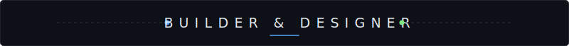
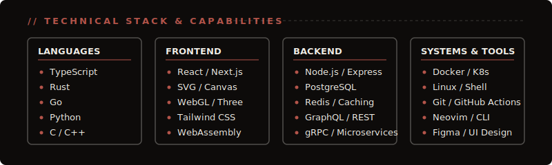
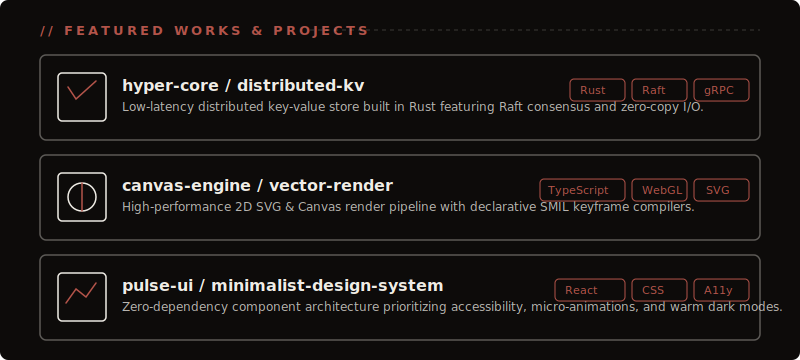
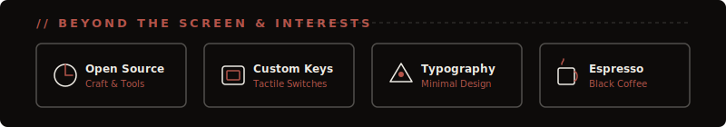
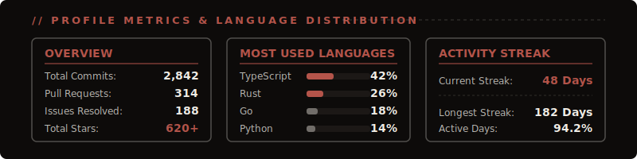

  <!-- 1. NAME ANIMATION -->
  

   

  <!-- 2. TITLE LINE -->
  

   

  <!-- 3. CENTERPIECE MONITOR / KEYBOARD SCENE -->
  

   

  <!-- 4. SOCIAL MEDIA POPUP CARDS -->
  

   

  <!-- 5. TECHNICAL STACK -->
  

   

  <!-- 6. CHOSEN PROJECTS -->
  

   

  <!-- 7. HOBBIES & INTERESTS -->
  

   

  <!-- 8. CONTRIBUTION GRAPH -->
  

   

  <!-- 9. GITHUB STATS & LANGUAGES -->
  

